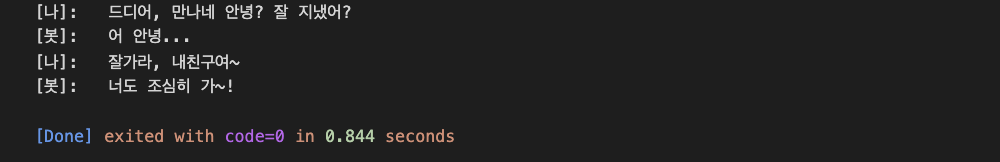

# __[1주차] n-gram을 이용한 simple 챗봇 구현__

## __[Simple Bot]__ Run example : JAVA

***

>[파일 참고]
>>./java/src/ChatBot.java  
>>./java/src/ChatBot.java

>[결과 화면]
>>

## __[Simple Bot]__ Run example : Python

***

>[실행 코드]
>>```bash
>>python ./week_01/main.py --n 2 --q "잘가라, 내친구여~"
>>```

>[결과 화면]
>>

## __[News Scraper]__ Run example : Python

***

이후 진행할 추천시스템에 사용할 데이터를 수집하기 위해 ZUM 포털 사이트의 뉴스 수집  
데이터 조회 속도 지연에 강건한 FGF 형식의 데이터 저장
>[Example]
>>\<__id\__>0  
>>\<__url\__>https://news.zum.com//articles/74175808  
>>\<__section\__>culture  
>>\<__sub_section\__>영화계 소식  
>>\<__title\__>[Pick] '어제는 감독 오늘은 작가'…영화감독 '부캐' 전성시대  
>>\<__summary\__>▲ 시립미술관에서 열렸던 팀 버튼 전시 홍보영상 중 일부 최근 영화감독들을 영화관이 아닌 전시장에서 만나볼 기회가 많아졌습니다  
>>\<__dttm\__>2022.03.05 09:11  
>>\<__media\__>SBS  
>>\<__content\__>최근 영화감독들을 영화관이 아닌 전시장에서 만나볼 기회가 많아졌습니다. 최근 감독들의 '부캐' 활동이 활발하기 때문입니다.
오늘(4일) 미술계는 다음 달인 4월 우리에게 '가위손'(1990), '찰리와 초콜릿 공장'(2005) 등 개성 넘치는 영화감독으로 기억되는 팀 버튼 감독의 개인전이 예정되어 있다고 밝혔습니다.
팀 버튼 감독은 영화감독 데뷔 전에도 디즈니의 일러스트레이터로 활동했던 아티스트로, 2009년 미국 뉴욕 현대미술관(MoMA)에서의 첫 개인전을 시작으로 작가 활동을 이어가고 있습니다.
스크린을 꾸미는 영화감독으로서의 '본캐'와 더불어 캔버스 위에서의 예술로 관람객과 만나는 작가로서 '부캐' 활동을 병행하고 있는 겁니다.

>[실행 코드]
>>```bash
>>python ./week_01/news_scraper.py --url "https://news.zum.com/issuelist/60055642?"
>>```
