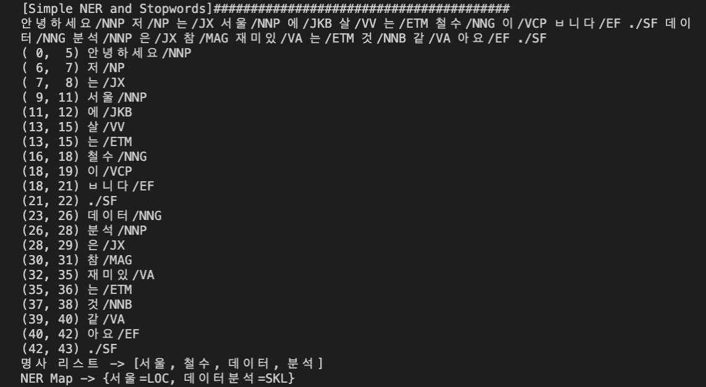

# __[2주차]__ Simple 형태소 분석, 개체명 인식, 금칙어 구현

## __[설명]__

***

> 1. (Komoran 및 KoNLPy를 이용한) 형태소 분석
> 2. (Komoran 및 KoNLPy를 이용한) 개체명 인식 및 금칙어 구현
> 3. 형태소 분석을 이용한 Week_01 Simple 챗봇 업데이트 (질문-답변 셋 추가 업데이트 필요...)
>
>> 3.1. 명사 추출
>>
>> 3.2. 특정 명사가 챗봇 질문-답변 셋에 포함된 경우 해당 셋 인덱스 추출
>>
>> 3.3. 답변의 다양성을 위해 여러 질문이 채택된 경우 랜던하게 챗봇 답변

## __[Simple KoNLPy]__ Run example : JAVA

***

> [실행 결과] - 형태소 분석
>
>> 
>
> [실행 결과] - 개체명 인식 및 금칙어 구현
>
>> 
>
> [실행 결과] - 형태소 분석을 이용한 Week_01 Simple 챗봇 업데이트
>
>> 

## __[Simple KoNLPy]__ Run example : Python

***

> [결과 화면]
>
>> 
>
> [실행 코드]
>
>> ```bash
>> python ./week_02/python/simple_konlpy.py
>> ```
