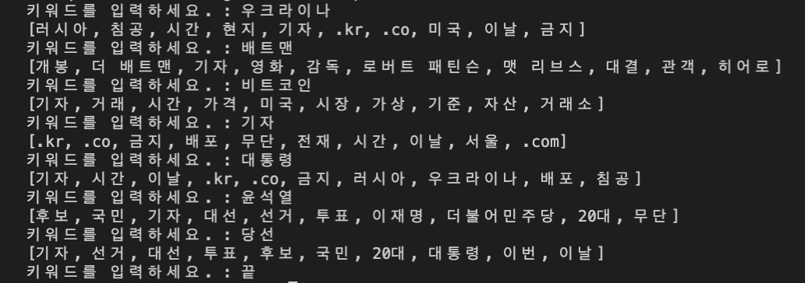

# __[3주차]__ Term-Frequency 기반 연관 단어 추출

## __[설명]__

***

> 1. 수진된 뉴스 데이터 불러오기 (setNesData Method)
> 2. 뉴스에 포함된 [title, summary, content] 명사리스트 생성 (extractNounMap Method)
> 3. 섹션별 Term-Frequency 계산 (calTF Method)
> 4. TF 기반 섹션별 Corpus 생성 (sortedKwdMap Method)
> 5. 연관 키워드 추출 (relationKwds Method)

## Run example : JAVA

***

> [실행 결과]
>
>> 
>>
>> <u>! .kr .co .com 등 불필요한 단어가 포함</u>  
>> <u>! 해당 단어들에 대해서 금칙어 단어사전 또는 영어 전처리 과정 구축 필요</u>
>

## Run example : Python

***

> [실행 결과]
